# LADON Threat XDR - Architecture Diagrams

This document provides comprehensive diagrams of the LADON Threat XDR platform architecture, with detailed focus on the Collection Service.

## Table of Contents
- [Overall System Architecture](#overall-system-architecture)
- [Lambda Architecture Pattern](#lambda-architecture-pattern)
- [Collection Service Architecture](#collection-service-architecture)
- [Data Flow Diagrams](#data-flow-diagrams)
- [Kubernetes Deployment Architecture](#kubernetes-deployment-architecture)
- [Service Communication Patterns](#service-communication-patterns)

---

## Overall System Architecture

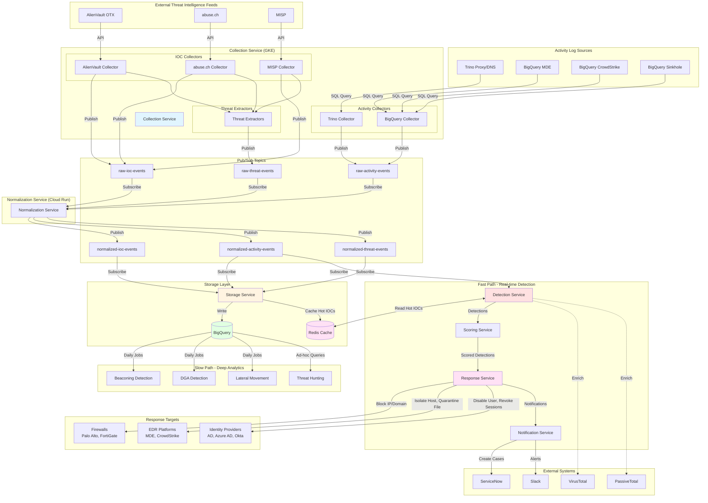

---

## Lambda Architecture Pattern

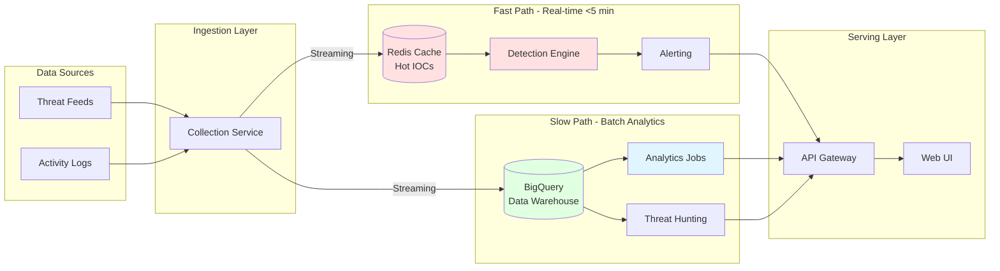

**Key Characteristics:**

- **Fast Path**: Real-time IOC correlation with <5 minute latency
  - Uses Redis cache for hot IOCs (last 48 hours, confidence >0.7)
  - Processes 10M+ events/day
  - Target: <100ms detection latency per batch

- **Slow Path**: Deep behavioral analytics running daily/weekly
  - Beaconing detection, DGA analysis, lateral movement
  - Full historical data analysis in BigQuery
  - Complex queries across billions of records

---

## Collection Service Architecture

```mermaid
graph TB
    subgraph "Collection Service Pod"
        MAIN[main.py<br/>FastAPI Application]

        subgraph "IOC Collectors"
            AV_C[AlienVault Collector]
            AC_C[abuse.ch Collector]
            MISP_C[MISP Collector]
        end

        subgraph "Activity Collectors"
            TRINO_C[Trino Collector<br/>Proxy/DNS]
            BQ_C[BigQuery Collector<br/>MDE/CS/Sinkhole]
        end

        subgraph "Threat Extractors"
            BASE_TE[BaseThreatExtractor]
            AV_TE[AlienVault Extractor]
            AC_TE[abuse.ch Extractor]
            MISP_TE[MISP Extractor]
        end

        subgraph "Core Components"
            WM[Watermark Manager]
            PUB[Pub/Sub Publisher]
            CONFIG[Config Loader]
        end

        subgraph "Health & Metrics"
            HEALTH[/health endpoint]
            METRICS[/metrics endpoint<br/>Prometheus]
        end
    end

    subgraph "ConfigMap"
        CM_ENV[Environment Variables]
        CM_YAML[config.yaml]
    end

    subgraph "Secrets"
        API_KEYS[API Keys]
        GCP_SA[GCP Service Account]
    end

    subgraph "Firestore"
        WM_STORE[(Watermark Storage)]
    end

    subgraph "Pub/Sub"
        T1[raw-ioc-events]
        T2[raw-activity-events]
        T3[raw-threat-events]
    end

    %% Configuration
    CM_ENV --> CONFIG
    CM_YAML --> CONFIG
    API_KEYS --> CONFIG
    GCP_SA --> CONFIG

    CONFIG --> MAIN

    %% Main orchestration
    MAIN -->|Start Background Tasks| AV_C
    MAIN -->|Start Background Tasks| AC_C
    MAIN -->|Start Background Tasks| MISP_C
    MAIN -->|Start Background Tasks| TRINO_C
    MAIN -->|Start Background Tasks| BQ_C

    %% IOC Collection
    AV_C -->|Check Watermark| WM
    AC_C -->|Check Watermark| WM
    MISP_C -->|Check Watermark| WM

    WM <-->|Read/Write| WM_STORE

    AV_C -->|Publish IOCs| PUB
    AC_C -->|Publish IOCs| PUB
    MISP_C -->|Publish IOCs| PUB

    %% Threat Extraction
    AV_C -->|Raw Data| AV_TE
    AC_C -->|Raw Data| AC_TE
    MISP_C -->|Raw Data| MISP_TE

    AV_TE -.->|Inherits| BASE_TE
    AC_TE -.->|Inherits| BASE_TE
    MISP_TE -.->|Inherits| BASE_TE

    AV_TE -->|Publish Threats| PUB
    AC_TE -->|Publish Threats| PUB
    MISP_TE -->|Publish Threats| PUB

    %% Activity Collection
    TRINO_C -->|Check Watermark| WM
    BQ_C -->|Check Watermark| WM
    TRINO_C -->|Publish Activities| PUB
    BQ_C -->|Publish Activities| PUB

    %% Publishing
    PUB --> T1
    PUB --> T2
    PUB --> T3

    %% Health
    MAIN --> HEALTH
    MAIN --> METRICS

    style MAIN fill:#e1f5ff
    style WM fill:#fff4e1
    style PUB fill:#ffe1e1
    style BASE_TE fill:#e1ffe1
```

### Component Details

**Collectors** (5 total):
- **AlienVault OTX**: Pulses API, 1-hour interval
- **abuse.ch**: Multiple feeds (URLhaus, ThreatFox, etc.), 1-hour interval
- **MISP**: Events API, 1-hour interval
- **Trino**: Proxy/DNS logs, 15-minute interval
- **BigQuery**: MDE/CrowdStrike/Sinkhole, 15-minute interval

**Threat Extractors** (3 total):
- Extract threat actors, campaigns, malware families
- Generate threat IDs and IOC associations
- Normalize threat data across different feed formats

**Watermark Manager**:
- Tracks last successful collection timestamp per source
- Stored in Firestore for persistence
- Enables incremental collection and failure recovery

---

## Data Flow Diagrams

### IOC Collection Flow

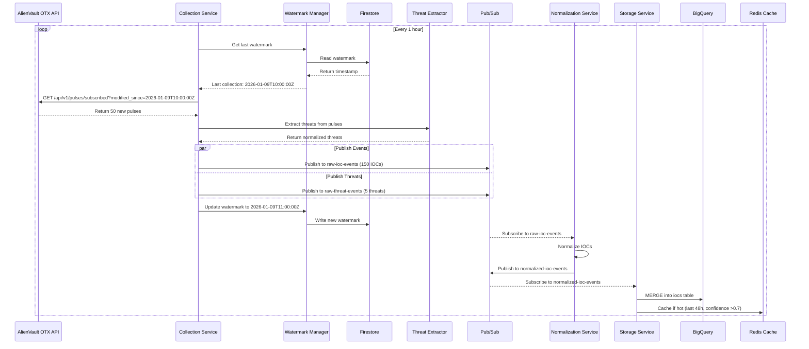

### Activity Collection Flow

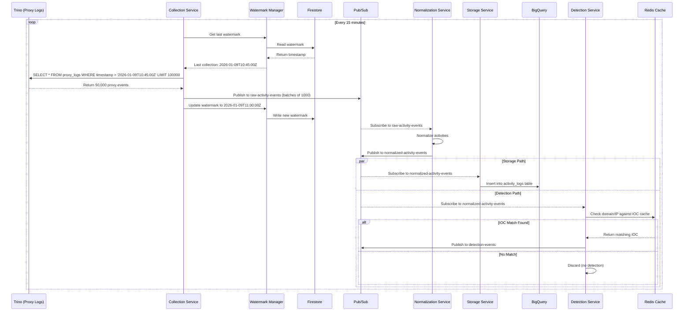

### Real-time Detection Flow

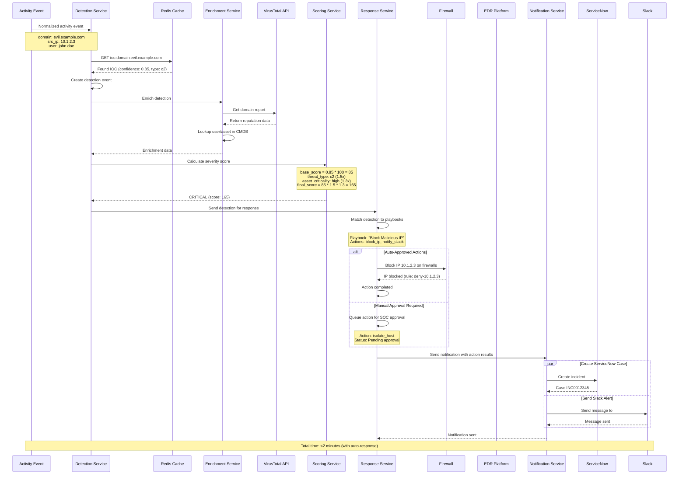

### Response Service Architecture

```mermaid
graph TB
    subgraph "Response Service"
        MAIN[main.py<br/>FastAPI Application]

        subgraph "Core Components"
            ENGINE[Response Engine]
            PLAYBOOK_MATCHER[Playbook Matcher]
            APPROVAL[Approval Workflow]
        end

        subgraph "Action Executors"
            FW_EXEC[Firewall Executor]
            EDR_EXEC[EDR Executor]
            IAM_EXEC[Identity Executor]
            NOTIF_EXEC[Notification Executor]
        end

        subgraph "Playbook Storage"
            PLAYBOOKS[(Registered Playbooks)]
        end

        subgraph "Action History"
            ACTIONS[(Action Tracking)]
        end

        subgraph "Health & Metrics"
            HEALTH[/health endpoint]
            METRICS[/metrics endpoint]
            API[REST API<br/>approve, reject, rollback]
        end
    end

    subgraph "Input - Detection Events"
        PS_DET[detection-events<br/>Pub/Sub Topic]
    end

    subgraph "External Systems - Firewalls"
        PALO[Palo Alto PAN-OS]
        FORTI[Fortinet FortiGate]
        GCP_FW[GCP Firewall Rules]
    end

    subgraph "External Systems - EDR"
        MDE[Microsoft Defender]
        CS[CrowdStrike]
    end

    subgraph "External Systems - Identity"
        AD[Active Directory]
        AZURE_AD[Azure AD]
        OKTA[Okta]
    end

    subgraph "Notifications"
        SLACK_N[Slack]
        EMAIL[Email]
        SNOW_N[ServiceNow]
    end

    %% Detection Input
    PS_DET -->|Subscribe| MAIN
    MAIN --> ENGINE

    %% Playbook Matching
    ENGINE --> PLAYBOOK_MATCHER
    PLAYBOOK_MATCHER <--> PLAYBOOKS
    PLAYBOOK_MATCHER --> ENGINE

    %% Approval Workflow
    ENGINE --> APPROVAL
    APPROVAL -->|Auto-Approved| ENGINE
    APPROVAL -->|Pending| API
    API -->|Approve/Reject| APPROVAL
    APPROVAL -->|Approved| ENGINE

    %% Action Execution
    ENGINE --> FW_EXEC
    ENGINE --> EDR_EXEC
    ENGINE --> IAM_EXEC
    ENGINE --> NOTIF_EXEC

    %% Firewall Actions
    FW_EXEC -->|Block IP/Domain| PALO
    FW_EXEC -->|Block IP/Domain| FORTI
    FW_EXEC -->|Create Rules| GCP_FW

    %% EDR Actions
    EDR_EXEC -->|Isolate Host| MDE
    EDR_EXEC -->|Isolate Host| CS
    EDR_EXEC -->|Quarantine File| MDE
    EDR_EXEC -->|Kill Process| CS

    %% Identity Actions
    IAM_EXEC -->|Disable User| AD
    IAM_EXEC -->|Disable User| AZURE_AD
    IAM_EXEC -->|Suspend User| OKTA
    IAM_EXEC -->|Revoke Sessions| AZURE_AD

    %% Notifications
    NOTIF_EXEC --> SLACK_N
    NOTIF_EXEC --> EMAIL
    NOTIF_EXEC --> SNOW_N

    %% Action Tracking
    ENGINE -->|Record Actions| ACTIONS
    ACTIONS -->|Query Status| API

    %% Health
    MAIN --> HEALTH
    MAIN --> METRICS

    style ENGINE fill:#ffe1e1
    style PLAYBOOK_MATCHER fill:#e1f5ff
    style APPROVAL fill:#fff4e1
    style FW_EXEC fill:#e1ffe1
    style EDR_EXEC fill:#e1ffe1
    style IAM_EXEC fill:#e1ffe1
    style NOTIF_EXEC fill:#e1ffe1
```

**Response Playbook Example:**

```yaml
playbook_id: "playbook_block_malicious_ip"
name: "Block Malicious IP"
description: "Auto-block IPs associated with C2, malware, or ransomware"

trigger_conditions:
  severity: [CRITICAL, HIGH]
  threat_types: [c2, malware, ransomware]
  ioc_types: [ip]

actions:
  - action_type: block_ip
    parameters:
      duration_hours: 24
      firewall_targets: [palo_alto, gcp_firewall]
      direction: both
    approval_required: none  # Auto-execute

  - action_type: notify_slack
    parameters:
      channel: "#security-alerts"
      message: "Malicious IP blocked automatically"
    approval_required: none

enabled: true
auto_approve: true
```

**Approval Workflow:**

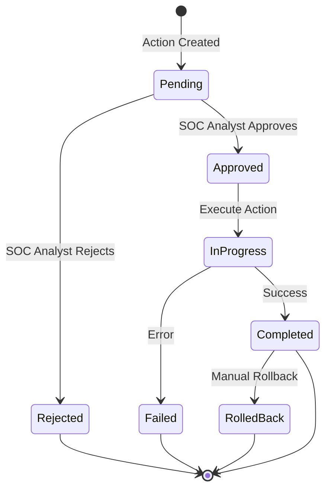

**Supported Response Actions:**

| Category | Action | Description | Approval Level |
|----------|--------|-------------|----------------|
| Network | `block_ip` | Block IP address on firewalls | Auto / None |
| Network | `block_domain` | Block domain via DNS/URL filtering | Auto / None |
| Network | `block_url` | Block specific URL | Auto / None |
| Endpoint | `isolate_host` | Network isolate endpoint | SOC Lead |
| Endpoint | `quarantine_file` | Quarantine malicious file | SOC Analyst |
| Endpoint | `kill_process` | Terminate running process | SOC Analyst |
| Endpoint | `collect_forensics` | Collect memory/disk forensics | SOC Lead |
| Identity | `disable_user` | Disable user account | SOC Analyst |
| Identity | `reset_password` | Force password reset | SOC Analyst |
| Identity | `revoke_session` | Invalidate active sessions | Auto / None |
| Investigation | `capture_memory` | Capture memory dump | SOC Lead |
| Investigation | `capture_network` | Capture network traffic | SOC Analyst |
| Notification | `notify_slack` | Send Slack alert | Auto / None |
| Notification | `notify_email` | Send email notification | Auto / None |
| Notification | `create_ticket` | Create ServiceNow ticket | Auto / None |

---

## Kubernetes Deployment Architecture

```mermaid
graph TB
    subgraph "GKE Cluster"
        subgraph "ladon Namespace"
            subgraph "collection-service Deployment"
                POD1[Pod 1<br/>collection-service]
                POD2[Pod 2<br/>collection-service]
                POD3[Pod 3<br/>collection-service]
            end

            SVC[Service<br/>collection-service<br/>ClusterIP]

            CM1[ConfigMap<br/>collection-config]
            CM2[ConfigMap<br/>collection-config-yaml]
            SECRET[Secret<br/>collection-secrets]

            SA[ServiceAccount<br/>collection-service]
            HPA[HPA<br/>2-10 replicas]
            PDB[PodDisruptionBudget<br/>minAvailable: 1]
            NP[NetworkPolicy]
            SM[ServiceMonitor<br/>Prometheus]
        end

        subgraph "Monitoring"
            PROM[Prometheus]
            GRAF[Grafana]
        end

        subgraph "kube-system"
            DNS[CoreDNS]
            INGRESS[Ingress Controller]
        end
    end

    subgraph "GCP Services"
        PUBSUB[Cloud Pub/Sub]
        FIRESTORE[Firestore]
        GCS[Cloud Storage]
        SECRETMGR[Secret Manager]
        WORKLOAD[Workload Identity]
        GSA[GCP Service Account<br/>collection-sa]
    end

    subgraph "External APIs"
        AV[AlienVault OTX]
        AC[abuse.ch]
        MISP_EXT[MISP]
        TRINO_EXT[Trino]
        BQ_EXT[BigQuery]
    end

    %% Configuration
    CM1 --> POD1
    CM1 --> POD2
    CM1 --> POD3
    CM2 --> POD1
    CM2 --> POD2
    CM2 --> POD3
    SECRET --> POD1
    SECRET --> POD2
    SECRET --> POD3

    %% Service Account
    SA --> POD1
    SA --> POD2
    SA --> POD3
    SA -->|Workload Identity| WORKLOAD
    WORKLOAD --> GSA

    %% Service
    SVC --> POD1
    SVC --> POD2
    SVC --> POD3

    %% HPA
    HPA -.->|Scale| POD1
    HPA -.->|Scale| POD2
    HPA -.->|Scale| POD3

    %% Monitoring
    SM --> POD1
    SM --> POD2
    SM --> POD3
    PROM -->|Scrape| SM
    GRAF -->|Query| PROM

    %% GCP Access
    POD1 -->|Publish| PUBSUB
    POD2 -->|Publish| PUBSUB
    POD3 -->|Publish| PUBSUB
    POD1 -->|Read/Write| FIRESTORE
    POD2 -->|Read/Write| FIRESTORE
    POD3 -->|Read/Write| FIRESTORE

    %% External APIs
    POD1 -->|Collect| AV
    POD1 -->|Collect| AC
    POD1 -->|Collect| MISP_EXT
    POD2 -->|Collect| TRINO_EXT
    POD3 -->|Collect| BQ_EXT

    %% Network Policy
    NP -.->|Allow Egress| POD1
    NP -.->|Allow Egress| POD2
    NP -.->|Allow Egress| POD3

    style POD1 fill:#e1f5ff
    style POD2 fill:#e1f5ff
    style POD3 fill:#e1f5ff
    style SVC fill:#fff4e1
    style HPA fill:#ffe1e1
    style SA fill:#e1ffe1
```

### Kubernetes Resource Hierarchy

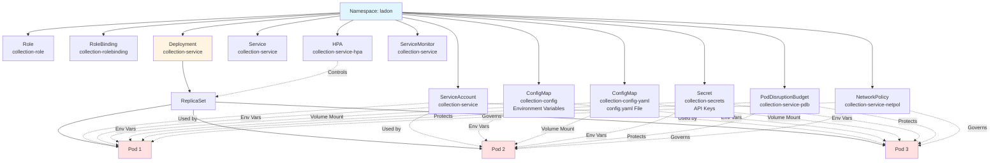

---

## Service Communication Patterns

### Async Messaging (Primary Pattern)

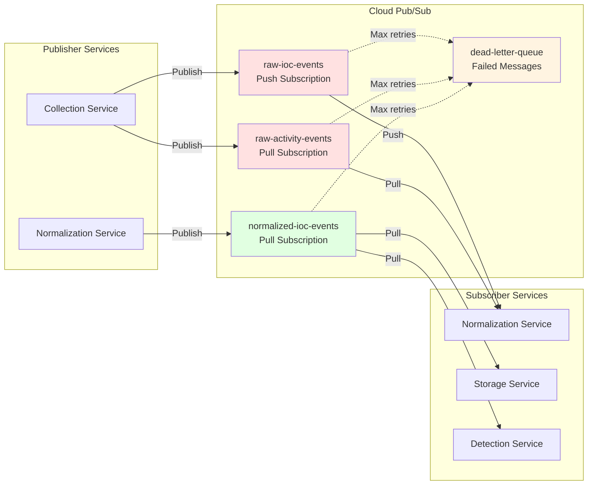

**Key Characteristics:**
- **Decoupling**: Services don't need to know about each other
- **Reliability**: Messages persisted, auto-retry on failure
- **Scalability**: Subscribers can scale independently
- **Dead Letter Queue**: Failed messages after max retries

### Sync API Calls (Secondary Pattern)

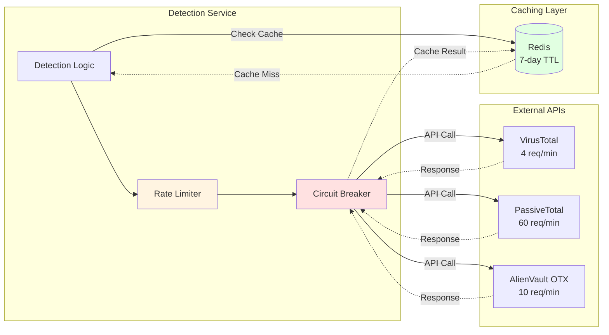

**Key Characteristics:**
- **Circuit Breaker**: Prevents cascading failures (5 failures → 60s timeout)
- **Rate Limiting**: Respects API quotas
- **Caching**: 7-day TTL for enrichment data
- **Exponential Backoff**: Retry with increasing delays

---

## Collection Service Internal Flow

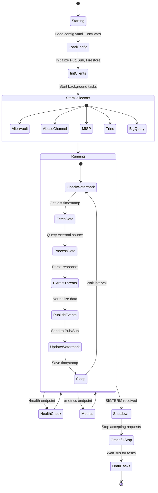

---

## Monitoring & Observability

### Metrics Collection Flow

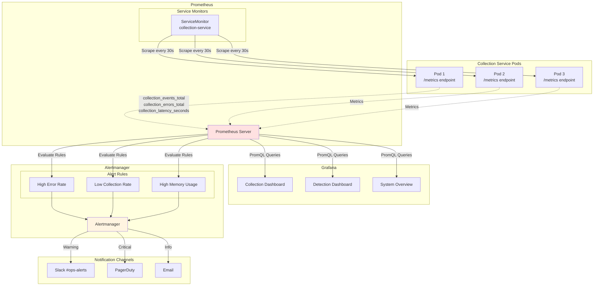

### Key Metrics

**Collection Metrics:**
- `collection_events_total` - Total events collected per source
- `collection_errors_total` - Errors during collection
- `collection_latency_seconds` - Time to complete collection cycle
- `watermark_lag_seconds` - Time between current time and last watermark

**Resource Metrics:**
- `container_cpu_usage_seconds_total` - CPU usage
- `container_memory_working_set_bytes` - Memory usage
- `process_resident_memory_bytes` - Process memory

**Pub/Sub Metrics:**
- `pubsub_publish_latency_seconds` - Time to publish messages
- `pubsub_publish_errors_total` - Failed publishes
- `pubsub_message_size_bytes` - Message size distribution

---

## Deployment Environments

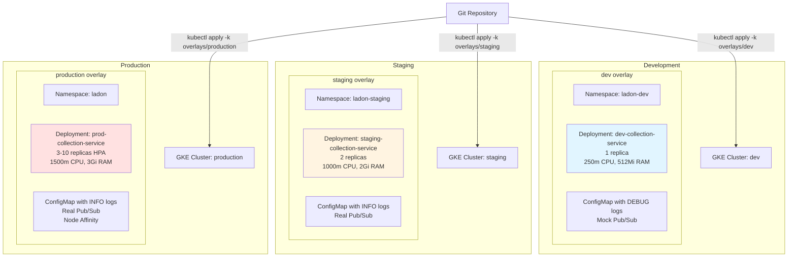

---

## Summary

This architecture provides:

1. **Scalability**: Horizontal pod autoscaling, Cloud Pub/Sub decoupling
2. **Reliability**: Pod disruption budgets, health checks, graceful shutdown
3. **Security**: RBAC, Workload Identity, network policies, secret management
4. **Observability**: Prometheus metrics, structured logging, distributed tracing
5. **Maintainability**: Kustomize overlays, GitOps workflows, declarative configuration

**Key Performance Targets:**
- Detection Latency: <5 minutes (p95)
- Throughput: 10M+ events/day
- Uptime: 99.9%
- False Positive Rate: <5% for high-severity alerts
